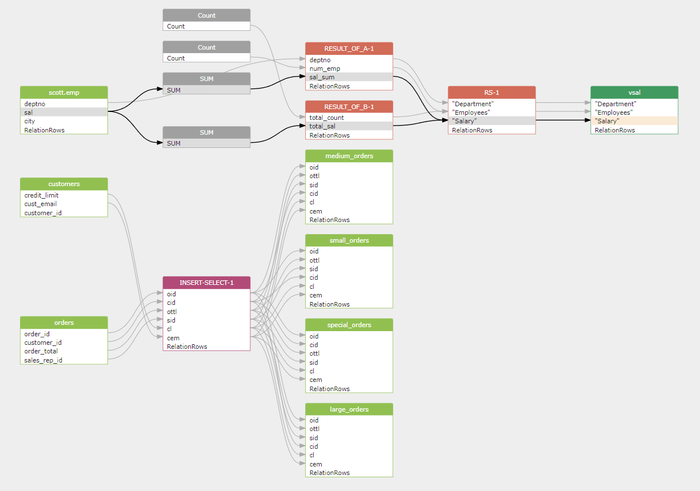
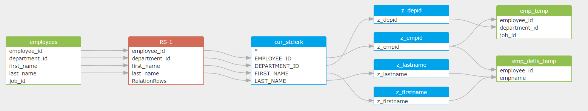
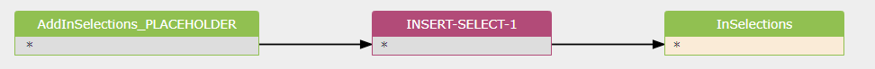
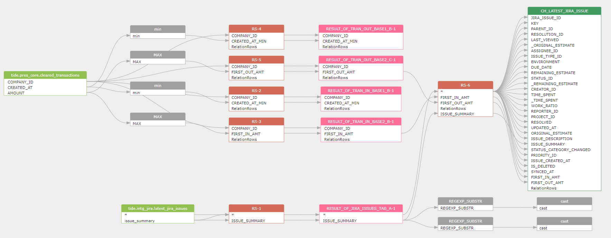
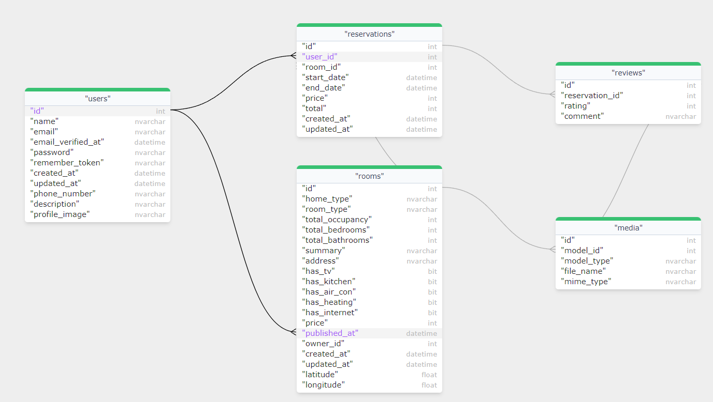

## Gudu SQLFlow Lite version for python

[Gudu SQLFlow](https://sqlflow.gudusoft.com)  is a tool used to analyze SQL statements and stored procedures 
of various databases to obtain complex [data lineage](https://en.wikipedia.org/wiki/Data_lineage) relationships and visualize them.

[Gudu SQLFlow Lite version for python](https://github.com/sqlparser/python_data_lineage) allows Python developers to quickly integrate data lineage analysis and 
visualization capabilities into their own Python applications. It can also be used in daily work by data scientists to quickly discover 
data lineage from complex SQL scripts that usually used in ETL jobs do the data transform in a huge data platform. 

Gudu SQLFlow Lite version for python is free for non-commercial use and can handle any complex SQL statements 
with a length of up to 10k, including support for stored procedures. It supports SQL dialect from more than 
20 major database vendors such as Oracle, DB2, Snowflake, Redshift, Postgres and so on.

Gudu SQLFlow Lite version for python includes [a Java library](https://www.gudusoft.com/sqlflow-java-library-2/) for analyzing complex SQL statements and 
stored procedures to retrieve data lineage relationships, [a Python file](https://github.com/sqlparser/python_data_lineage/blob/main/dlineage.py) that utilizes jpype to call the APIs 
in the Java library, and [a JavaScript library](https://docs.gudusoft.com/4.-sqlflow-widget/get-started) for visualizing data lineage relationships.

Gudu SQLFlow Lite version for python can also automatically extract table and column constraints, 
as well as relationships between tables and fields, from [DDL scripts exported from the database](https://docs.gudusoft.com/6.-sqlflow-ingester/introduction)
and generate an ER Diagram.

### Automatically visualize data lineage

By executing this command:
```
python dlineage.py /t oracle /f test.sql /graph
```

We can automatically obtain the data lineage relationships contained in the following Oracle SQL statement.
```sql
CREATE VIEW vsal 
AS 
  SELECT a.deptno                  "Department", 
         a.num_emp / b.total_count "Employees", 
         a.sal_sum / b.total_sal   "Salary" 
  FROM   (SELECT deptno, 
                 Count()  num_emp, 
                 SUM(sal) sal_sum 
          FROM   scott.emp 
          WHERE  city = 'NYC' 
          GROUP  BY deptno) a, 
         (SELECT Count()  total_count, 
                 SUM(sal) total_sal 
          FROM   scott.emp 
          WHERE  city = 'NYC') b 
;

INSERT ALL
	WHEN ottl < 100000 THEN
		INTO small_orders
			VALUES(oid, ottl, sid, cid)
	WHEN ottl > 100000 and ottl < 200000 THEN
		INTO medium_orders
			VALUES(oid, ottl, sid, cid)
	WHEN ottl > 200000 THEN
		into large_orders
			VALUES(oid, ottl, sid, cid)
	WHEN ottl > 290000 THEN
		INTO special_orders
SELECT o.order_id oid, o.customer_id cid, o.order_total ottl,
o.sales_rep_id sid, c.credit_limit cl, c.cust_email cem
FROM orders o, customers c
WHERE o.customer_id = c.customer_id;
```

And visualize it as:


### Oracle PL/SQL Data Lineage 
```
python dlineage.py /t oracle /f samlples/oracle_plsql.sql /graph
```



The [source code of this sample Oracle PL/SQL](samples/oracle_plsql.sql).

### Able to analyze dynamic SQL to get data lineage (Postgres stored procedure)
```sql
CREATE OR REPLACE FUNCTION t.mergemodel(_modelid integer)
RETURNS void
LANGUAGE plpgsql
AS $function$
BEGIN
    EXECUTE format ('INSERT INTO InSelections
                                  SELECT * FROM AddInSelections_%s', modelid);
                  
END;
$function$
```


  
### Nested CTE with star columns (Snowflake SQL sample)
```
python dlineage.py /t snowflake /f samlples/snowflake_nested_cte.sql /graph
```



The [snowflake SQL source code of this sample](samples/snowflake_nested_cte.sql).  

### Analyze DDL and automatically draw an ER Diagram.

By executing this command:
```
python dlineage.py /t sqlserver /f samples/sqlserver_er.sql /graph /er
```

We can automatically obtain the ER Diagram of the following SQL Server database:



The [DDL script of the above ER diagram is here](samples/sqlserver_er.sql).

## Try your own SQL scripts

You may try more SQL scripts in your own computer without any internet connection by cloning [this python data lineage repo](https://github.com/sqlparser/python_data_lineage)
```shell
git clone https://github.com/sqlparser/python_data_lineage.git
```

- No database connection is needed.
- No internet connection is needed.

You only need a JDK and a python interpreter to run the Gudu SQLFlow lite version for python. 

### Step 1: Prerequisites
  * Install python3
  * Install Java jdk1.8

### Step 2: Open the web service
 Switch to the widget directory of this project and execute the following command to start the web service:

 `python -m http.server 8000`
  
  Open the following URL in a web browser to verify if the startup was successful：http://localhost:8000/
  
  Note: If you want to modify the port 8000, you need to modify the widget_server_url in dlineage.py accordingly.

### step 3 Execute the python script
  Open a new command window, switch to the root directory of this project, where the dlineage.py file is located, and execute the following command:

  `python dlineage.py /t oracle /f test.sql /graph`
   
   This command will perform data lineage analysis on test.sql and open a web browser page to display the results of the analysis in a graphical result.
   
   Explanations of the command-line parameters supported by dlineage.py:

      /t: Required, specify the database type
        
		The valid value: access,bigquery,couchbase,dax,db2,greenplum, gaussdb, hana,hive,impala,informix,mdx,mssql,
        sqlserver,mysql,netezza,odbc,openedge,oracle,postgresql,postgres,redshift,snowflake,
        sybase,teradata,soql,vertica 
		
		the default value is oracle

      /f: optional, The SQL file that needs to be processed, if this option is not specified, /d must be speicified.

      /d: optional, All SQL files under this directory will be processed.

      /j: optional, The analyzed result will include the join relationship.

      /s: optional, Ignore the intermediate results of the output data lineage.

      /topselectlist: optional, output the column in select list. this option valid only /s is specified.

      /withTemporaryTable: optional, only valid use with /s option, including the data lineage of temporary table used in the SQL.

      /i: optional, this option work almost the same as /s option, but will keep the data lineage generated by function call.
  
      /if: optional, keep all the intermediate result in the output data lineage, but remove the result derived from function call.

      /ic: optional, ignore the coordinate in the output.

      /lof: optional, if a column in the SQL is not qualifiey with a table name, and multiple tables are used in the from clause, then, the column will be linked to the first table in from clause.

      /traceView: optional, only list source table and view, ignore all intermediate result.

      /json: optional, ouput in json format.

      /tableLineage [/csv /delimiter]: optional, only output data lineage at table level.

      /csv: optional, output the data lineage in CSV format.

      /delimiter: optional, specify the separate character used in CSV output.

      /env: optional, specify a metadata.json to provide the metadata that can be used during SQL analysis.

      /transform: optional, includind the code that do the transform.

      /coor: optional, whether including the coordinate in the output.

      /defaultDatabase: optional, specify a default database.

      /defaultSchema: optional, specify a default schema.

      /showImplicitSchema: optional, Display the schema information inferred from the SQL statement.

      /showConstant: optional, whether show constant.

      /treatArgumentsInCountFunctionAsDirectDataflow: optional,treate column used in count function as a direct dataflow.

      /filterRelationTypes: optional, supported types: fdd，fdr，join，call，er，seperated by comma if multiple values are specified.

      /graph: optional, automatically open web browser to show the data lineage diagram.
      /er: optional, automatically open web browser to show the ER diagram.
	  
	  
### Export metadata from various databases.
You can export metadata from the database using [SQLFlow ingester](https://github.com/sqlparser/sqlflow_public/releases) 
and hand it over to Gudu SQLFlow for data lineage analysis.。

[Document of the SQLFlow ingester](https://docs.gudusoft.com/6.-sqlflow-ingester/introduction)

## Trouble shooting

## Contact
For further information, please contact support@gudusoft.com